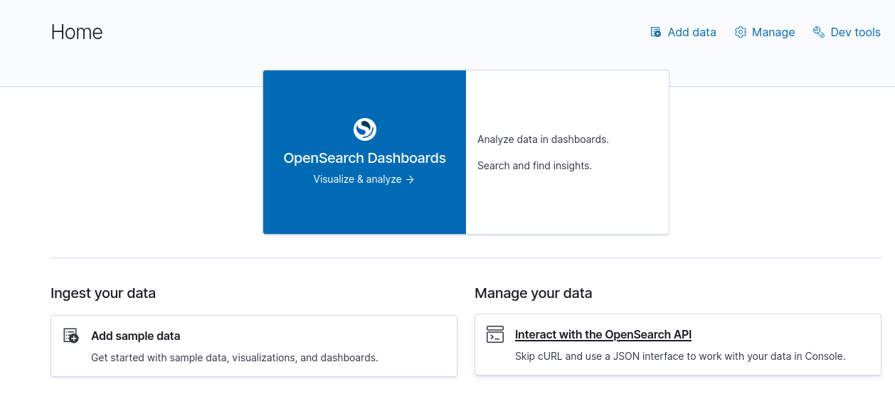
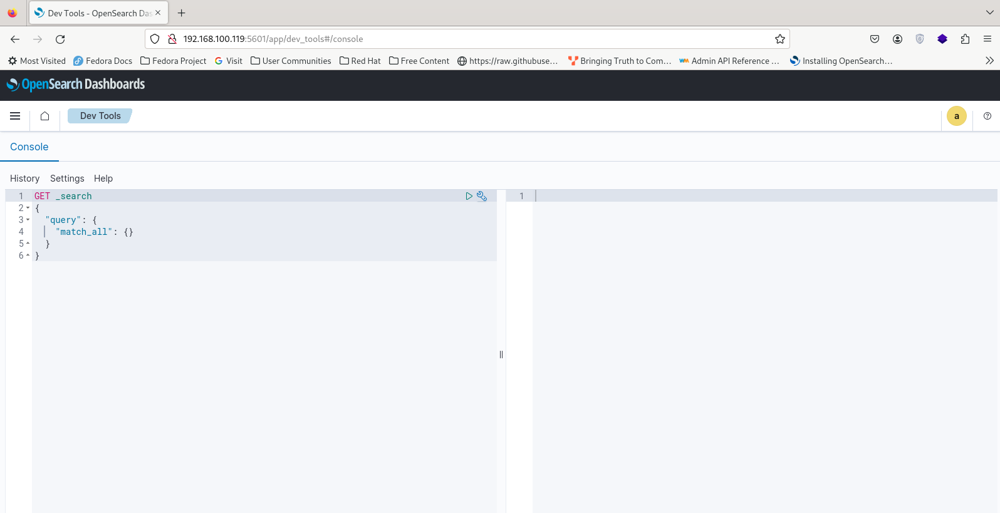
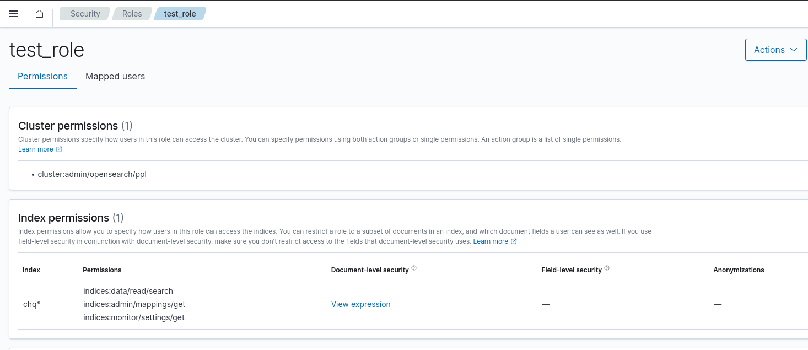

### Generating a BASIC auth value:

You can use the following web site:
https://www.blitter.se/utils/basic-authentication-header-generator/

Or use base64 command in linux:

```shell
$base64
<user>:<password><CTRL+D><generated base64 value>
```

> Note: don't press ENTER before pressing CTRL+D

> Using **-k** option with curl is to ignore certificate https checking.

> Note: you can also use -u and --insecure options with curl:  **curl -u 'admin:admin' --insecure** or use **-H '
Authorization: Basic YWRtaW46YWRtaW4='**


## How to run APIs inside opensearch web dashboard
1- From the home page, select "Interact with the OpenSearch API":


2- Run desired commands in console page:


## OpenSearch Access Control REST API

https://opensearch.org/docs/latest/security/access-control/api/

### Get Users List

```shell
curl --insecure -XGET https://192.168.100.119:9200/_plugins/_security/api/internalusers/ -u 'admin:admin' | jq
``` 

### Get specific user info

```shell
curl -k -XGET GET https://192.168.100.119:9200/_plugins/_security/api/internalusers/test_use -H 'Authorization: Basic YWRtaW46YWRtaW4=' | jq
```

### Get Account Info

```shell
curl -k -XGET https://192.168.100.119:9200/_plugins/_security/api/account \
 -H 'Authorization: Basic YWRtaW46YWRtaW4=' | jq
```

## Document Level Security (DLS)

Documents URL:
https://opensearch.org/docs/latest/security/access-control/document-level-security/

Use following template in **_role definition_** page, where document doesn't have access field or its value is low or medium:
```json
{
  "bool": {
    "should": [
      {
        "bool": {
          "must_not": {
            "exists": {
              "field": "access"
            }
          }
        }
      },
      {
        "term": { "access": "low" }
      },
      {
        "term": { "access": "medium" }
      }
    ]
  }
}
```

### Alternatively, Creating Role for Document Level Security (DLS)

```shell
curl -k -XPUT https://192.168.100.119:9200/_plugins/_security/api/roles/access_high -H 'Content-Type: application/json' \
 -H 'Authorization: Basic YWRtaW46YWRtaW4=' \
 --data '{
  "cluster_permissions": [
    "*"
  ],
  "index_permissions": [{
    "index_patterns": [
      "chq*"
    ],
    "dls": "{\"access\": \"high\"}",
    "allowed_actions": [
      "read"
    ]
  }]
 }' | jq
```

You can also create another role without DLS, and assign it to administrators:

```shell
curl -k -XPUT https://192.168.100.119:9200/_plugins/_security/api/roles/access_all -H 'Content-Type: application/json' \
 -H 'Authorization: Basic YWRtaW46YWRtaW4=' \
 --data '{
  "cluster_permissions": [
    "*"
  ],
  "index_permissions": [{
    "index_patterns": [
      "chq*"
    ],
    "allowed_actions" : [ "indices:data/read/search/template" ]
  }]
 }' | jq
 ```

## Assign role to a user

> Note: user roles are known as backend_roles.
> In order to assign a role to user you can patch user info:

```shell
curl -k -XPATCH https://192.168.100.119:9200/_plugins/_security/api/internalusers/test_user -H 'Content-Type: application/json' \
 -H 'Authorization: Basic YWRtaW46YWRtaW4=' \
 --data '
 [
  {
    "op": "replace", "path": "/backend_roles", "value": ["test_role"]
  }
 ]' | jq
```


## Creating a Test Document
```text
PUT https://192.168.100.119:9200/chq-sample-index/_doc/1
Authorization: Basic YWRtaW46YWRtaW4=
Content-Type: application/json

{
  "@timestamp": "2024-01-26 13:16:18.802",
  "Description": "To be or not to be, that is the question.",
  "access": "medium"
}
```

> Note: If you run this command several time, it updates the previous document with new field values


## Roles needed (for a user) to view Logs in Dashboard
